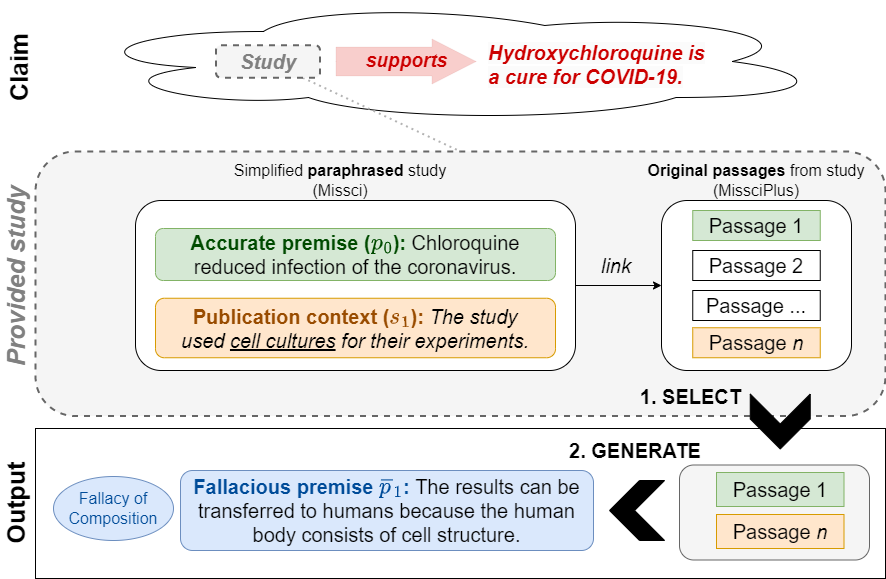

# Grounding Fallacies Misrepresenting Scientific Publications in Evidence (Preprint 2024)
[](https://opensource.org/licenses/Apache-2.0)
[](https://www.python.org/)


> **Abstract:** 
>     Health-related misinformation claims often falsely cite a credible biomedical publication as evidence, which superficially appears to support the false claim. The publication does not really support the claim, but a reader could believe it thanks to the use of logical fallacies. Here, we aim to detect and to highlight such fallacies, which requires carefully assessing the exact content of the misrepresented publications. To achieve this, we introduce MissciPlus, an extension of the fallacy detection dataset Missci. MissciPlus builds on Missci by grounding the applied fallacies in real-world passages from misrepresented studies. This creates a realistic test-bed for detecting and verbalizing these fallacies under real-world input conditions, and enables novel passage-retrieval tasks. MissciPlus is the first logical fallacy dataset which pairs the real-world misrepresented evidence with incorrect claims, identical to the input to evidence-based fact-checking models. With MissciPlus, we i) benchmark retrieval models in identifying passages that support claims only when fallacies are applied, ii) evaluate how well LLMs articulate fallacious reasoning from misrepresented scientific passages, and iii) assess the effectiveness of fact-checking models in refuting claims that misrepresent biomedical research. Our findings show that current fact-checking models struggle to use relevant passages from misrepresented publications to refute misinformation. Moreover, these passages can mislead LLMs into accepting false claims as true.


Contact person: [Max Glockner](mailto:max.glockner@tu-darmstadt.de) 

[UKP Lab](https://www.ukp.tu-darmstadt.de/) | [TU Darmstadt](https://www.tu-darmstadt.de/)

This repository contains MissciPlus, an extension of the Missci dataset ([Glockner et al., 2024](https://arxiv.org/abs/2406.03181)), which grounds fallacies in real-world passages from misrepresented scientific publications. Don't hesitate to send us an e-mail or report an issue, if you have further questions. **Code is coming soon!**

# The MissciPlus Dataset
We provide a validation split and a test split for the MissciPlus dataset, following the dataset splits in Missci:
- **Validation Split**: [missciplus-dataset/dev.missciplus.jsonl](missciplus-dataset/dev.missciplus.jsonl)
- **Test Split**: [missciplus-dataset/test.missciplus.jsonl](missciplus-dataset/test.missciplus.jsonl)
  
Each line in these files represents one instance of the dataset, which consists of a complete fallacious argument. The overall JSON structure for each instance is as follows:


```json
{
    "id": "<A unique ID for this instance (string)>",
    "meta": "<Additional information about the fact-checking article used to generate this instance (object)>",
    "argument": "<The reconstructed fallacious argument based on Missci (object)>",
    "study": "<The misrepresented scientific publication (object)>"
}
```

## How to understand the `"study"` field
Each `"study"` has the following format:
```json
{
    "pmc_id": "<PubMed Central ID of the publication>",
    "all_passages": {
        "<passage-id-1>": "<Passage content (object)>",
        "<passage-id-2>": "<Passage content (object)>",
        "...": "..."
    },
    "selected_passages": {
        "<passage-id-1>": "<Passage content (object)>",
        "<passage-id-2>": "<Passage content (object)>",
        "...": "..."
    }
}
```

All passages in `"selected_passages"` have been chosen for annotation. These passages have been compared and annotated with each paraphrased content (accurate premise and fallacy context) in the `"argument"`. We link these passages with the accurate premise and publication context, within the `"argument"` structure (see below).
The passages in `"all_passages"` comprise all parsed passages, including those that have been selected for annotation. Each passage has the following properties:
| Property | Description | 
|----------|----------|
| `"passage_id"`    | The unique passage ID  | 
| `"section"`    | The title of the passage's section (if available). | 
| `"sentences"`    | A list of the passage sentences.   | 
| `"from"`    | Indicates whether the passage was collected from the structured abstract (`"abstract"`) or the main paper content (`"main"`).   | 

**Example:**
```json
{
    "section": "Postinfection chloroquine treatment is effective in preventing the spread of SARS-CoV infection",
    "sentences": [
        "In order to investigate the antiviral properties of chloroquine on SARS-CoV after the initiation of infection, Vero E6 cells were infected with the virus and fresh medium supplemented with various concentrations of chloroquine was added immediately after virus adsorption.",
        "Infected cells were incubated for an additional 16-18 h, after which the presence of virus antigens was analyzed by indirect immunofluorescence analysis.",
        "When chloroquine was added after the initiation of infection, there was a dramatic dose-dependant decrease in the number of virus antigen-positive cells (Fig. 2A).",
        "As little as 0.1-1 muM chloroquine reduced the infection by 50% and up to 90-94% inhibition was observed with 33-100 muM concentrations (Fig. 2B).",
        "At concentrations of chloroquine in excess of 1 muM, only a small number of individual cells were initially infected, and the spread of the infection to adjacent cells was all but eliminated.",
        "A half-maximal inhibitory effect was estimated to occur at 4.4 ± 1.0 muM chloroquine (Fig. 2C).",
        "These data clearly show that addition of chloroquine can effectively reduce the establishment of infection and spread of SARS-CoV if the drug is added immediately following virus adsorption."
    ],
    "from": "main",
    "passage_id": "PMC1232869-7"
}
```


## Grounding the `"argument"` in the `"study"`
In the Missci dataset, each `"argument"` is structured as follows:
```json
{
    "claim": "<The claim that misrepresents the scientific publication (string.)>",
    "accurate_premise_p0": {
        "premise": "<The paraphrased study content based on which the claim was made (string).>"
    },
    "fallacies": [
        {
            "fallacy_context": "<The paraphrased study content based on which the fallacy can be detected (string).>",
            "interchangeable_fallacies": "<List of the verbalized fallacious premises and the applied fallacy classes (list[object]).>"
        },
        {
            "<more fallacies>": "..."
        }
    ]
}
```

The content of the `"premise"` field (in `"accurate_premise_p0"`) and the `"fallacy_context"` field (for each fallacy in `"fallacies"`) paraphrases content from the misrepresented study. These fields should, if possible, be linked to a passage within `"study"`.
To provide this linkage, we include a `"mapping"` property. This property contains a list of mappings to all `"selected_passages"` that convey the same information as the the paraphrased field content. If the `"mapping"` list is empty, it means no passage could be linked to the accurate premise or fallacy context. Each entry in a successful mapping has the following properties:


| Property | Description | 
|----------|----------|
| `"passage"`    | The unique passage ID that communicates the same information as this field. | 
| `"sentence_annotations"`    | Indicates which sentences have been selected to convey the same information as the paraphrased content (via the selected sentence indices per annotator). | 
| `"sentences"`    | A list of all sentence indices selected by any annotator. | 

**Example:**
```json
{
    "accurate_premise": {
        "premise": "Chloroquine reduced infection of the coronavirus.",
        "mapping": [
            {
                "passage": "PMC1232869-19",
                "sentence_annotations": [[0, 1, 4, 5], [0, 1, 2, 3, 4]],
                "sentences": [0, 1, 2, 3, 4, 5]
            },
            {"...": "..."}
        ]
    }
}
```

# Citation
When using MissciPlus, please ensure to cite the following publications:

```bibtex 
@article{glockner2024grounding,
  title={Grounding Fallacies Misrepresenting Scientific Publications in Evidence},
  author={Glockner, Max and Hou, Yufang and Nakov, Preslav and Gurevych, Iryna},
  journal={arXiv preprint [TBA]},
  year={2024}
}

@inproceedings{glockner-etal-2024-missci,
    title = "Missci: Reconstructing Fallacies in Misrepresented Science",
    author = "Glockner, Max  and
      Hou, Yufang  and
      Nakov, Preslav  and
      Gurevych, Iryna",
    editor = "Ku, Lun-Wei  and
      Martins, Andre  and
      Srikumar, Vivek",
    booktitle = "Proceedings of the 62nd Annual Meeting of the Association for Computational Linguistics (Volume 1: Long Papers)",
    month = aug,
    year = "2024",
    address = "Bangkok, Thailand",
    publisher = "Association for Computational Linguistics",
    url = "https://aclanthology.org/2024.acl-long.240",
    pages = "4372--4405"
}
```
> This repository contains experimental software and is published for the sole purpose of giving additional background details on the respective publication

